# 🎨 Vistara

This app is a digital gallery for browsing a collection of paintings online. It works on phones, tablets, and computers, with a clean layout that makes viewing artwork simple and pleasant.

The collection is stored securely in the cloud, so you can access it anytime. The app is built with modern web technologies to ensure a fast, reliable, and smooth experience.

## Technology Stack

| Category | Technologies |
|----------|--------------|
| **Languages** |   |
| **Frontend** |     |
| **Styling** |    |
| **Build Tools** |   |
| **Backend** |    |
| **Database** |  |
| **Security** |   |
| **Testing** |   |
| **Logging** |  |


  <br/>
  <br/>
  <br/>
  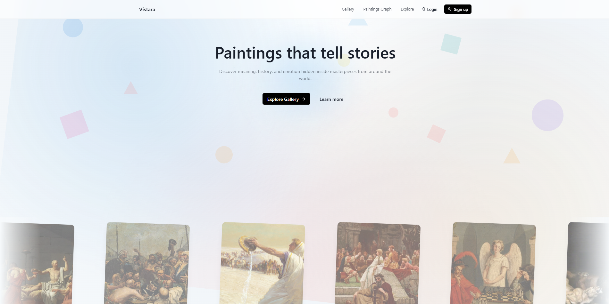
  <br/>
  <br/>
  <div style="display: felx; flexDirection: row;">
    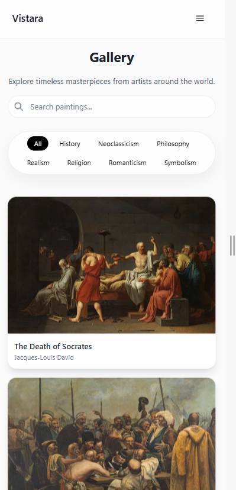
    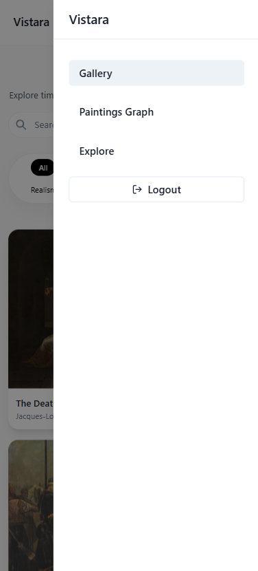
  </div>
  <br/>
  <br/>


## API Layer (Controllers)

The API follows a controller-based architecture to separate logic from routes.

### Get All Paintings

```js
const Painting = require("../models/Painting");
const logger = require("../utils/logger");

const getPaintings = async (req, res) => {
  try {
    logger.info("Fetching all paintings");

    const paintings = await Painting.find();

    logger.info("Paintings fetched successfully", {
      count: paintings.length,
    });

    res.json(paintings);
  } catch (err) {
    logger.error("Failed to fetch paintings", {
      error: err,
    });

    res.status(500).json({
      message: "Server error",
    });
  }
};
```

---

### Get Single Painting (with Related Works)

This endpoint fetches a painting and expands its related artworks using populate(), then flattens the result for easier frontend usage.

```js
const getPaintingById = async (req, res) => {
  try {
    logger.info("Fetching painting", {
      paintingId: req.params.id,
    });

    const painting = await Painting.findById(req.params.id)
      .populate("relatedPaintings.id");

    if (!painting) {
      logger.warn("Painting not found", {
        paintingId: req.params.id,
      });

      return res.status(404).json({
        message: "Painting not found",
      });
    }

    const formattedPainting = {
      ...painting.toObject(),
      relatedPaintings: painting.relatedPaintings
        .map((r) => {
          if (!r.id) return null;

          return {
            score: r.score,
            ...r.id.toObject(),
          };
        })
        .filter(Boolean),
    };

    logger.info("Painting fetched successfully", {
      paintingId: painting._id,
      title: painting.title,
      relatedCount: formattedPainting.relatedPaintings.length,
    });

    res.json(formattedPainting);
  } catch (err) {
    logger.error("Failed to fetch painting", {
      paintingId: req.params.id,
      error: err,
    });

    res.status(500).json({
      message: "Server error",
    });
  }
};
```

Logger demo:

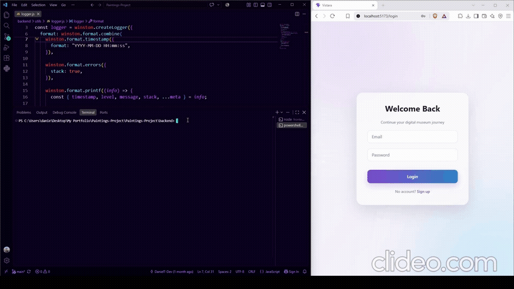

# Authentication System

Users can create accounts and securely log in. Passwords are never stored directly in the database. Instead, they are encrypted using **bcrypt hashing** before being saved.

After a successful login, the backend generates a **JWT (JSON Web Token)** which is stored on the client and used to maintain the user's authenticated session.

## User Entity

The `User` model stores account information and user preferences:

```js
const userSchema = new mongoose.Schema({
    username: {
        type: String,
        required: true,
        unique: true,
    },

    email: {
        type: String,
        required: true,
        unique: true,
    },

    password: {
        type: String,
        required: true,
    },

    favoritePaintings: [
        {
            type: mongoose.Schema.Types.ObjectId,
            ref: "Painting",
        },
    ],
});
```

## Password Security

During registration, passwords are hashed using bcrypt before being stored in MongoDB:

```js
const hashedPassword = await bcrypt.hash(
    password,
    10
);

const user = await User.create({
    username,
    email,
    password: hashedPassword,
});
```
During login, bcrypt compares the entered password with the stored encrypted password:
```js
const passwordMatch = await bcrypt.compare(
    password,
    user.password
);
```

## JWT Authentication
After successful authentication, the backend generates a JWT token:

```js
const token = jwt.sign(
    {
        id: user._id,
        username: user.username,
        email: user.email,
    },
    process.env.JWT_SECRET,
    {
        expiresIn: "7d",
    }
);
```
The token is returned to the frontend and stored locally. It is later used to identify the authenticated user.

<div style="display: felx; flexDirection: row;">
    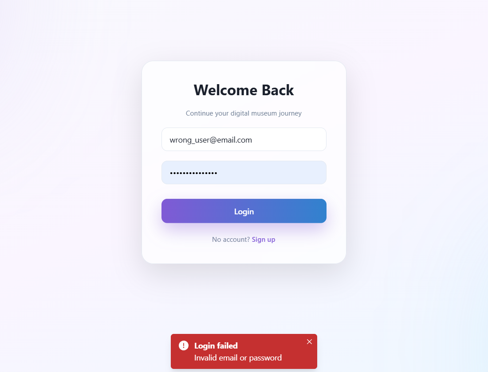
    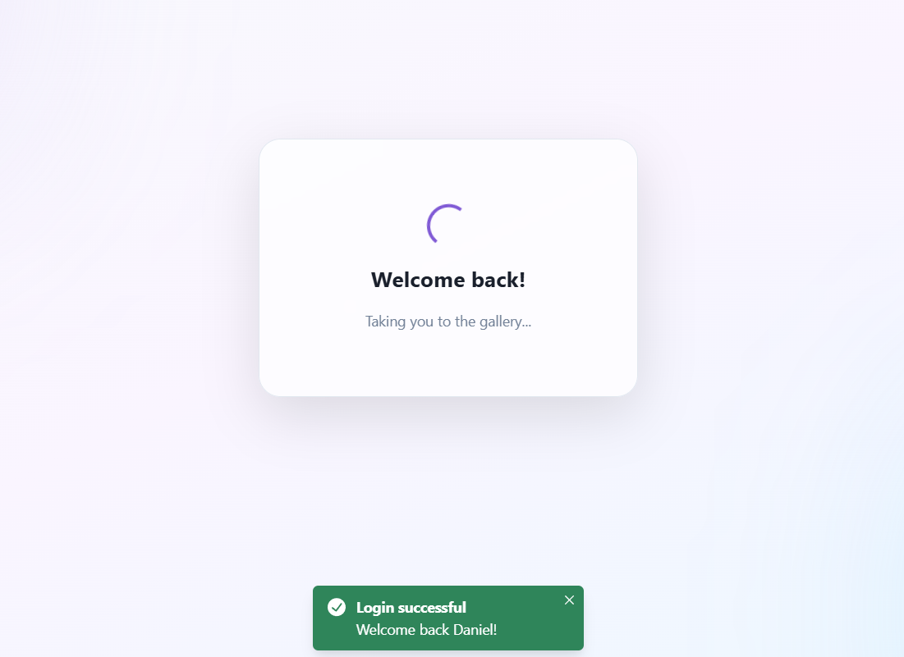
  </div>

## Validation

  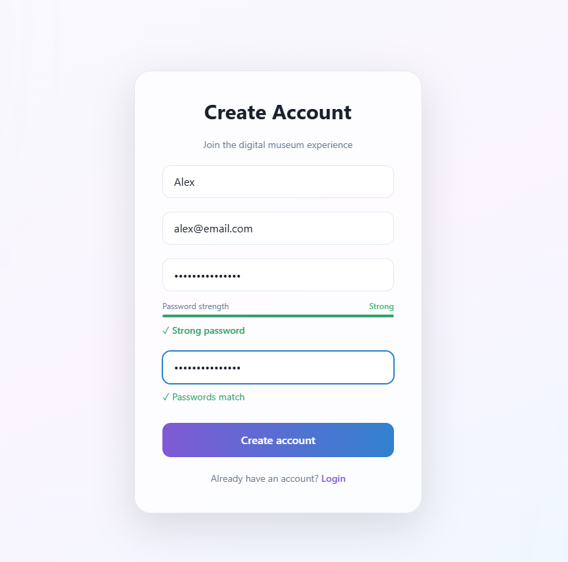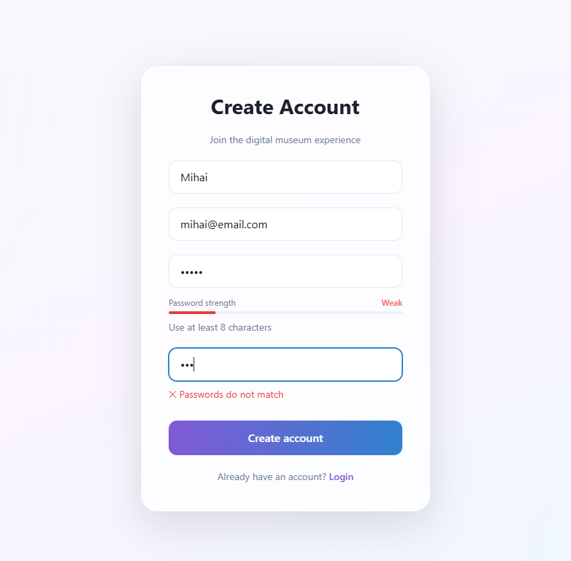

The authentication pages provide a modern user experience with:

* Username, email, password, and confirm password fields
* Password strength indicator
* Real-time password matching feedback
* Client-side validation
* Loading animations after successful actions
* Error messages for invalid input
* Automatic navigation after login/signup

Password validation checks include:

* Minimum password length
* Uppercase letters
* Lowercase letters
* Numbers
* Special characters

The signup form prevents weak passwords from being submitted and gives immediate feedback while the user is typing.

## Protected Routes

Protected routes use the Redux authentication state to control access to private pages. If a user is not authenticated, they are automatically redirected to the login page.

```js
function ProtectedRoute({ children }) {
  const isAuthenticated = useAppSelector(
    (state) => state.auth.isAuthenticated
  );

  if (!isAuthenticated) {
    return <Navigate to="/login" replace />;
  }

  return children;
}
```


## State Management with Redux

Redux Toolkit was used to manage authentication state globally across the application. An `authSlice` stores the current user, authentication token, and authentication status, allowing different components such as the Navbar and protected routes to access authentication information consistently.

The authentication state is persisted using `localStorage`, allowing the application to restore the user session after a page refresh. Separate actions are used for logging in, restoring an existing session, and logging out.

```js
const authSlice = createSlice({
  name: "auth",
  initialState: {
    user: null,
    token: null,
    isAuthenticated: false,
  },
  reducers: {
    login(state, action) {
      state.user = action.payload.user;
      state.token = action.payload.token;
      state.isAuthenticated = true;
    },

    logout(state) {
      state.user = null;
      state.token = null;
      state.isAuthenticated = false;
    },
  },
});
```


## Testing

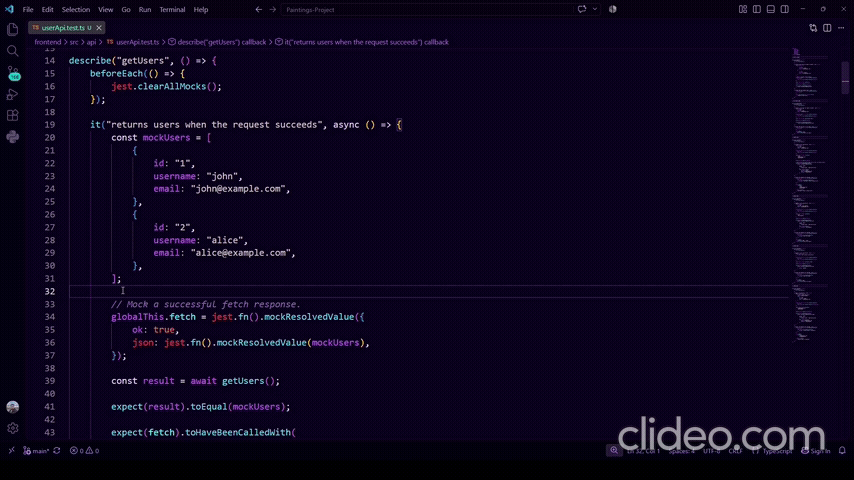

The authentication system is tested with **Jest** across three main areas: user API operations, Redux authentication state, and authentication utilities. The API tests cover CRUD operations and login, while Redux tests verify authentication state and `localStorage` behavior. Validation tests cover email, password, and password-strength rules.

```js
it("authenticates the user", () => {
    const state = reducer(
        initialState,
        login({
            user: testUser,
            token: "test-token",
        })
    );

    expect(state.isAuthenticated).toBe(true);
    expect(state.token).toBe("test-token");
});
```

The Redux authentication slice is tested separately to verify that login correctly updates the authenticated user, token, and initialization state. It also ensures that authentication data is persisted to localStorage as expected.

```js
const state = reducer(
    initialState,
    login({
        user: testUser,
        token: "test-token",
    })
);

expect(state.isAuthenticated).toBe(true);
expect(state.token).toBe("test-token");
expect(localStorage.getItem("token")).toBe("test-token");
```

Validation and password-strength utilities are tested as pure functions, allowing individual authentication rules to be verified without involving React or the backend. This provides a reliable foundation for future React Testing Library tests of complete login and registration flows.

```js
it("detects a strong password", () => {
    const result = evaluatePassword("Password1!");

    expect(result.score).toBe(5);
    expect(result.label).toBe("Strong");
    expect(result.isStrong).toBe(true);
});
```

## Testing Architecture

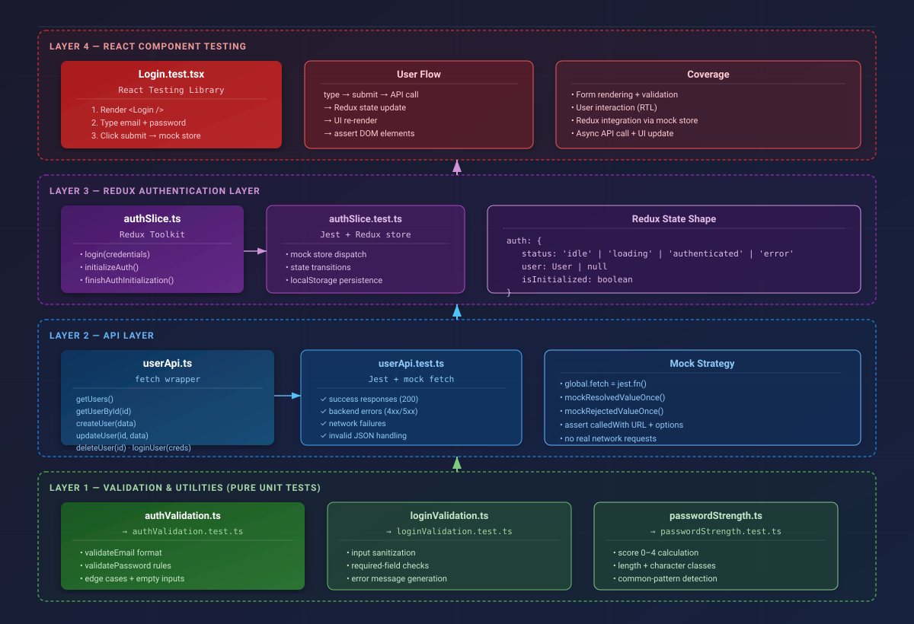


## Database Connection (MongoDB + Mongoose)

We connect to MongoDB using Mongoose and environment variables for configuration:

```js
const mongoose = require("mongoose");
require("dotenv").config();

const connectDB = async () => {
  try {
    const conn = await mongoose.connect(process.env.MONGO_URI);

    console.log(`MongoDB connected: ${conn.connection.host}`);
  } catch (error) {
    console.error("MongoDB connection error:", error.message);
    process.exit(1);
  }
};

module.exports = connectDB;
```

This ensures:
- Secure connection using .env
- Proper error handling on startup
- Clean server shutdown if DB connection fails

---

## Data Modeling (Mongoose Schema)

Paintings are stored using a structured schema that includes metadata and relationships to other paintings.

```js
const mongoose = require("mongoose");

const relatedPaintingSchema = new mongoose.Schema(
  {
    id: {
      type: mongoose.Schema.Types.ObjectId,
      ref: "Painting",
      required: true,
    },
    score: {
      type: Number,
      default: 0,
    },
  },
  { _id: false }
);

const paintingSchema = new mongoose.Schema(
  {
    title: String,
    artist: String,
    year: Number,
    medium: String,
    description: String,
    imageUrls: [String],
    tags: [String],

    relatedPaintings: [relatedPaintingSchema],
  },
  { timestamps: true }
);

module.exports = mongoose.model("Painting", paintingSchema);
```

This structure allows:
- Storing multiple images per painting
- Tag-based categorization
- Linking related paintings with a similarity score
- Efficient referencing using ObjectId + population

---

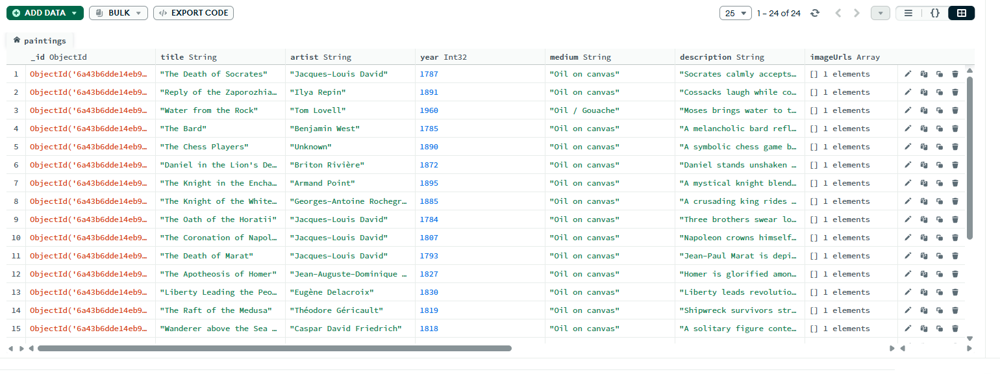
